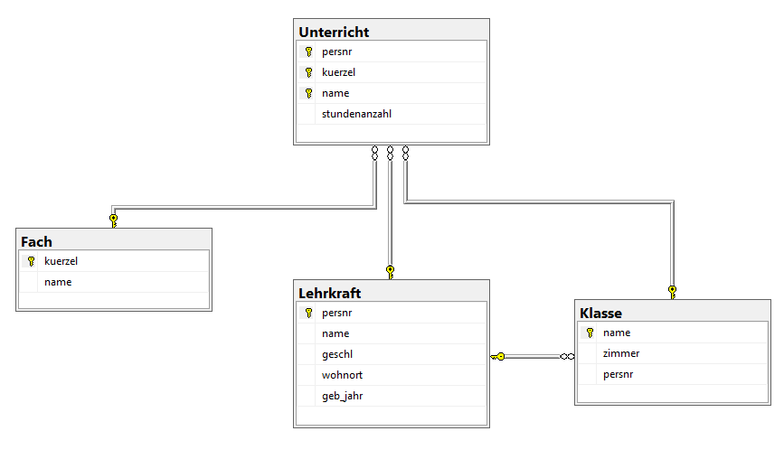

# Übung DDL - Create Table & Insert: Schul-DB

Erstellen Sie in sqlite3 für folgendes Diagramm die Tabellen.

Benennen Sie die Spalte wie abgebildet und definieren Sie geeigenete Datentypen für die Spalten.

Kennzeichnen Sie die gekennzeichneten Spalten als Primary Key.

Ebenso definieren Sie für den KV(persnr in der Tabelle Klassse) den Foreign Key, sowie für die Tabelle Unterricht die Primary + Foreign Keys

Zu guter letzt befüllen Sie die angelegten Tabellen mit mindesten 10 Datensätzen. Versuchen Sie sinnvolle Daten zu verwenden, da Sie diese Datenbank in diesem Semester nochmals benötigen werden.
