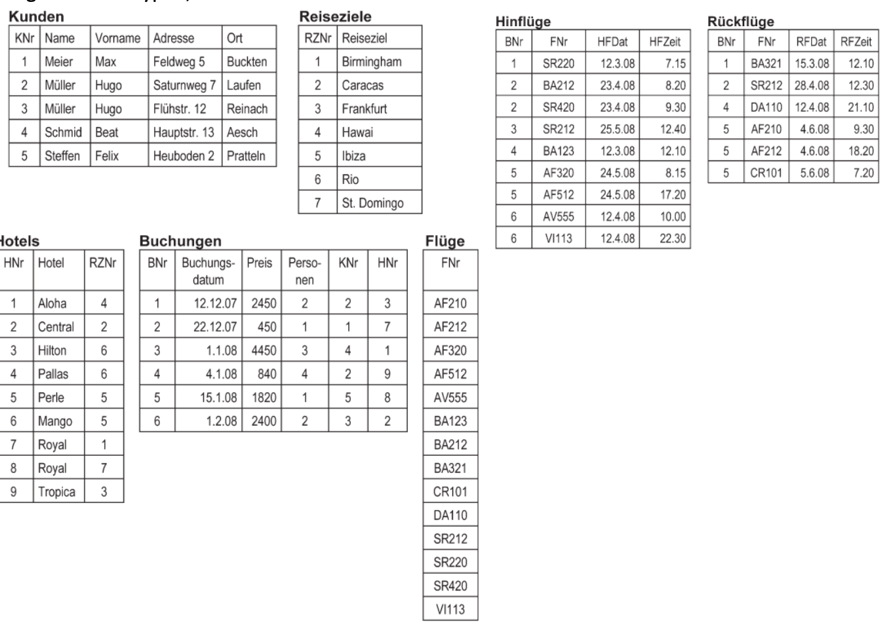

# Reisebürodatenbank

1. Erstellen Sie für folgende Grafik die Create – Table Statements. Vergessen Sie nicht auf die
   Löschstatements für die Tabellen. Achten Sie auf die richtige Reihenfolge! Wählen Sie
   geeignete Datentypen, die mit den Daten in der Grafik konform sind

2. Erstellen Sie folgende Primary- und Foreign-Key Constraints:

-   Primary Key
    -   Kunden: KNr
    -   Reiseziele: RZNr
    -   Hotels: HNr
    -   Buchungen: BNr
    -   Flüge: FNr
    -   Hinflüge, Rückflüge: FNr, BNr
-   Foreign Key
    -   Hinflüge, Rückflüge: BNr, FNr
    -   Buchungen: KNr, HNr
    -   Hotel: RZNr

3. Erstellen Sie folgende Column- bzw. Table Constraints

    - Überlegen Sie welche Spaten den Wert NULL annehmen dürfen? Versehen Sie die Spalte entsprechend
    - Die Flugnummer muss genau 5 Zeichen haben
    - Die Anzahl Personen muss größer 0 sein
    - Die Kombination Name, Adresse und Ort der Kunden muss eindeutig sein
    - Der Preis muss zwischen 50 und 5000 liegen
    - Die Hotels können nur Hilton, Royal, Central, Aloha, Pallas, Perle, Tropica oder Mango
    - Kein Reiseziel darf mehrfach vorkommen

4. Erstellen Sie die Insert-Statements für die oben dargestellten Werte
