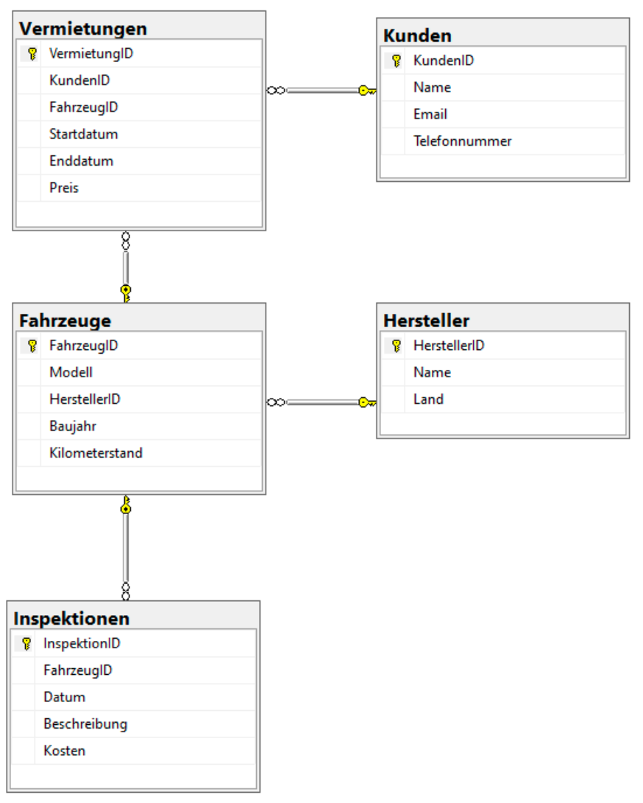

# Fahrzeugverwaltung

1. Nutzen Sie sqLite3. Benennen Sie die Datei in Nachname_Fahrzeuge.sql um. Geben Sie diese ab.
2. Ergänzen Sie die Datei mit den nötigen Lösch-Statements für die Tabellen und Indices.
3. Erstellen Sie für folgende Grafik die nötigen Primary Keys, Foreign Key und Not-Null Constraints

4. Erstellen Sie folgende Column- bzw. Table Constraints

-   Hersteller: Name muss eindeutig sein
-   Fahrzeuge: Kilometerstand muss größer 0 sein
-   Fahrzeuge: Das Baujahr muss nach 1945 liegen
-   Kunden: Email muss eindeutig sein
-   Kunden: Telefonnummer muss eindeutig sein
-   Vermietungen: Preis muss größer 0 sein
-   Vermietungen: Enddatum muss nach dem Startdatum liegen
-   Inspektionen: Kosten muss größer 0 sein

5. Erstellen Sie für jede Tabelle geeignete Indices. Mindestens je einen Index pro Tabelle. Begründen Sie, warum Sie diesen Index für geeignet erachten und anlegen. Fügen Sie beim Index einen Kommentar hierfür dazu
