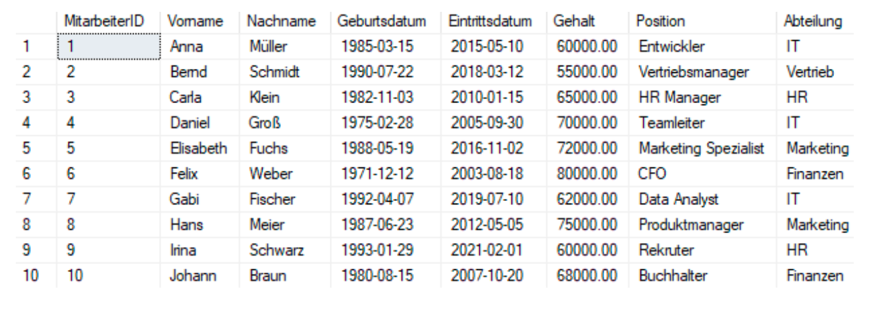

# Mitarbeiterverwaltung

1. Erstellen und löschen Sie die nötigen Indices
2. Überlegen Sie sich ob und welche Spalten den Wert NULL annehmen dürfen
3. Erstellen Sie für die Tabelle mindestens 5 sinnvolle Constraints
4. Erstellen Sie folgende Abfragen

-   Listen Sie den Vor- und Nachnamen inkl. Geburtsdatum aller Mitarbeiter auf
-   Listen Sie alle Mitarbeiter mit ihrem Alter sowie dem Vor- und Nachnamen auf
-   Listen Sie alle Mitarbeiter mit ihrem monatlichen Gehalt auf und stellen Sie den Nachnamen in Großbuchstaben dar
-   Listen Sie alle Mitarbeiter mit ihrem Vor- und Nachnamen, der Anzahl an Tagen und die Anzahl an Monaten die jeder im Unternehmen ist auf
-   Ermitteln Sie das Durchschnittsgehalt aller Mitarbeiter. Verwenden Sie für das Ergebnisattribut einen geeigneten Alias
-   Ermitteln Sie welche Abteilungen es im Unternehmen gibt
-   Listen Sie alle Mitarbeiter inkl. einem um 10% erhöhten Gehalt auf
-   Ermitteln Sie für jeden Mitarbeiter den Namen und das Jahresgehalt nach Steuern an. Nehmen wir an, dass die Steuer 20% des Gehalts beträgt
-   Erstelle eine Abfrage, die den vollständigen Namen (Vorname und Nachname) sowie die Position und die Abteilung in einem formatierten String für jeden Mitarbeiter zurückgibt
