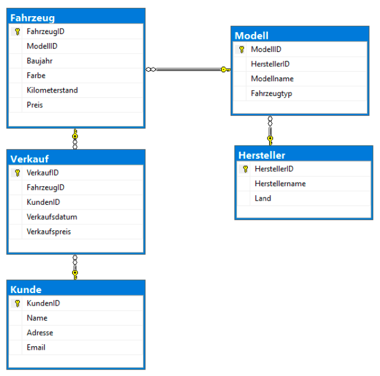

# Übung Joins und Group BY

Geben Sie die etwaige Nummer beim Statement als Kommentar an.

Folgende Abfragen sollen erstellt werden:

1. Ermitteln Sie die Anzahl an verkauften Fahrzeugen pro Hersteller absteigend nach der Anzahl der Verkauften Fahrzeuge
2. Ermitteln Sie den Gesamtwert aller Fahrzeuge und die Summe der Verkaufserlöse
3. Ermitteln Sie den durchschnittlichen Verkaufspreis pro Herkunftsland aufsteigend nach dem Verkaufspreis ab einem Baujahr größer gleich 2020
4. Ermitteln Sie die Fahrzeugtypkategorie mit dem höchsten Durchschnittspreis
5. Ermitteln Sie pro Autofarbe die Anzahl an Verkäufe und den Gewinn
6. Ermitteln Sie die Anzahl an gekauften Autos pro Kunde und die Summe, die er dafür ausgegeben hat
7. Ermitteln Sie die Gesamtanzahl der verkauften Fahrzeuge pro Herkunftsland mit mehr als 5 Verkäufen und das Herstellerland mehr als 5 Zeichen aufweist
