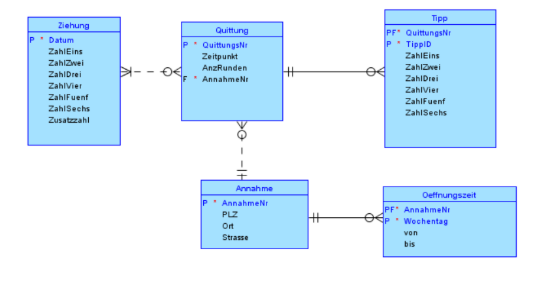

DBI V - Übungsbeispiel		Schuljahr 2025/26

**Lotto - 6 aus 45**

Gegeben ist folgendes ER-Diagramm einer Lotto-Gesellschaft:

Erklärungen:

- Ein Wettschein wird bei einer Annahmestelle (Nummer, Adresse) erfasst, man erhält eine Quittung (10-stellige Quittungsnummer, Zeitpunkt der Abgabe, Annahmestelle) zur Bestätigung der Teilnahme (Bezahlung) und zum Nachweis eines Gewinnanspruches.
- Ein Tipp besteht aus 6 verschiedenen Zahlen zwischen 1 und 45
- Auf einem Wettschein(Quittung) muss mindestens 1 Tipp vorhanden sein, aber es sind maximal 12 Tipps möglich.
- ` `Mit einem Wettschein (Quittung) nimmt man jedenfalls an der nächsten Ziehung teil, man kann auch an den nächsten bis zu 10 Ziehungen teilnehmen.
- Die Öffnungszeiten der Annahmestellen sind pro Wochentag festzuhalten. Pro Wochentag kann es mehrere Öffnungsintervalle (jeweils von, bis) geben.
- Bei einer Ziehung (jeden Mittwoch und Sonntag) werden 6 Zahlen und eine Zusatzzahl (alle 7 verschieden) gezogen.

**Aufgabenstellung:**  

1. Ändern Sie das gegebene Script zum Erstellen der Oracle-Datenbank so um, dass die Quittungsnummer mit einer Sequence zu vergeben ist.

1. Füllen Sie die Tabellen Annahme und Öffnungszeit mit Datensätzen.

1. Erstellen Sie eine boolsche Funktion Zahlen\_udf (Parameter: Datum), die überprüft, ob alle Zahlen einer Ziehung unterschiedliche Werte haben.

   *Hinweis*: Funktion kann auch für Tipps verwendet werden.

1. Erstellen Sie folgende Stored Procedures

\- Ziehungen\_erzeugen\_prc(Parameter: Startdatum, Anzahl)

Erzeugen Sie für Anzahl Datensätze das Ziehungsdatum (Zahlen bleiben Null), beachten Sie, dass Ziehungen nur am Mittwoch und Sonntag stattfinden.

\- Wettschein\_proc (Parameter: Annahmestelle, Zeitpunkt, AnzahlTipps (1 bis 12), AnzahlZiehungen (1 bis 10))

Die Tipps sollen mit einem Zufallszahlengenerator erstellt werden. Die erste Ziehung darf frühestens am nächsten Tag sein.

Procedure in einer Schleife (PL/SQL) aufrufen.

\- Ziehung\_proc (Parameter: Ziehungstag)

Für die angegebene Ziehung sollen per Zufallszahlengenerator die Zahlen (samt Zusatzzahl) ermittelt werden. 

Nötigenfalls die Ziehung in der Tabelle vorher anlegen.

1. Erstellen Sie die Anweisungen zum Ausführen folgender Abfragen
- Wie viele Stunden pro Woche haben die einzelnen Trafiken geöffnet?
- Welche Annahmestelle (Nummer und Adresse) hat in einem bestimmten Jahr den höchsten Umsatz?
- Pro Wochentag: Annahmestelle (Nummer und Adresse) mit den wenigsten (auch gar keinen = 0) Quittungen

Verwenden Sie gegebenenfalls zusätzliche Tabellen für Zwischenergebnisse (temporär).
