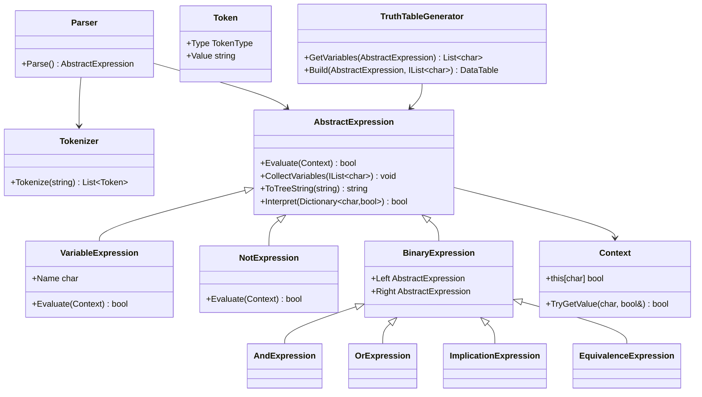

# UML-Klassendiagramm

```mermaid
classDiagram
    class AbstractExpression {
        +Evaluate(Context) bool
        +CollectVariables(IList~char~) void
        +ToTreeString(string) string
        +Interpret(Dictionary~char,bool~) bool
    }

    class VariableExpression {
        +Name char
        +Evaluate(Context) bool
    }

    class NotExpression {
        +Evaluate(Context) bool
    }

    class BinaryExpression {
        +Left AbstractExpression
        +Right AbstractExpression
    }

    class AndExpression
    class OrExpression
    class ImplicationExpression
    class EquivalenceExpression

    class Parser {
        +Parse() AbstractExpression
    }

    class Tokenizer {
        +Tokenize(string) List~Token~
    }

    class Token {
        +Type TokenType
        +Value string
    }

    class Context {
        +this[char] bool
        +TryGetValue(char, bool&) bool
    }

    class TruthTableGenerator {
        +GetVariables(AbstractExpression) List~char~
        +Build(AbstractExpression, IList~char~) DataTable
    }

    AbstractExpression <|-- VariableExpression
    AbstractExpression <|-- NotExpression
    AbstractExpression <|-- BinaryExpression
    BinaryExpression <|-- AndExpression
    BinaryExpression <|-- OrExpression
    BinaryExpression <|-- ImplicationExpression
    BinaryExpression <|-- EquivalenceExpression

    Parser --> Tokenizer
    Parser --> AbstractExpression
    AbstractExpression --> Context
    TruthTableGenerator --> AbstractExpression
```
